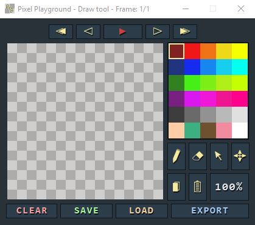
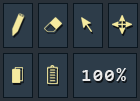
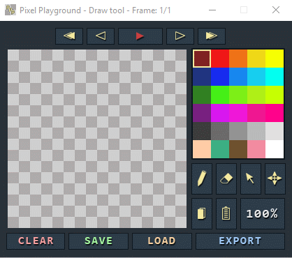
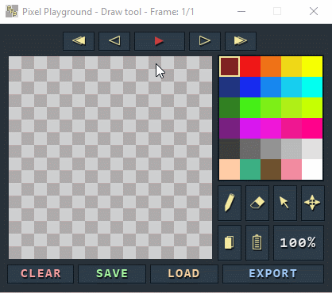
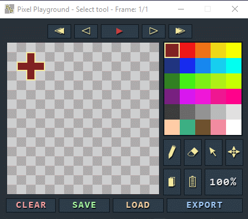
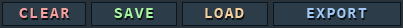

  

# Pixel Playground
A simple program for Windows that lets you make 16x16 pixels animations.

# User Interface
The application comes with a regular set of tools that include: __Draw__, __Erase__, __Select__ and __Move__. 
In addition to that it is also possible to copy and paste the selected pixels. Here resides the __Speed Modifier__ button as well. 
It lets you change the speed of the animation from 100% to 50%.

It is also possible to fill an area with a color by ctr + clicking while Draw tool is active. Same goes for the Select tool. ctrl + clicking an area while the tool is active will select the whole area. You can draw straight lines as well by first clicking on the starting pixel and then shift + clicking on another pixel.

### Move Tool
Using a move tool you can move selected pixels and while the pixels remain selected, they will not be put into the frames, thus you can move them as many times as you want without having to reselect them after each move.

### Copy/Paste
When certains pixels are selected, you can copy them into a clipboard and paste them into any frame. After pasting the pixels, they are immediately selected and can be moved with a Move tool.

There are 5 main frame control buttons that help easily navigate the frames.

 

At the bottom of the window there are additional buttons providing such functionality as saving the animation, loading the animation and exporting the animation into the individual frames. Also, here resides a Clear button, which clears the whole frame.

## Instalation
Simply go to Releases, download the latest version of the program and the follow the instructions of the installer.

